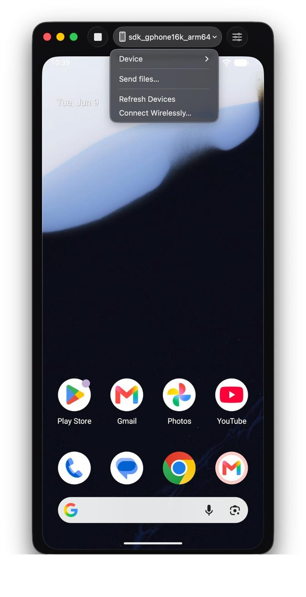
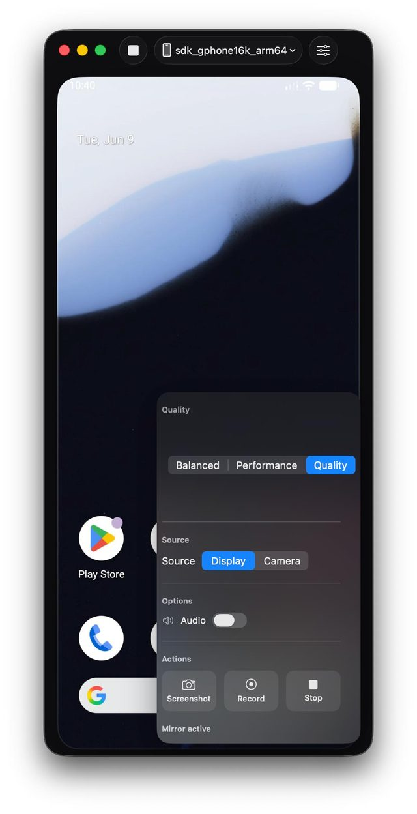

# Android Mirror — macOS Android Screen Mirroring App

Android Mirror is a native macOS app for Android screen mirroring and remote control. It uses [scrcpy](https://github.com/Genymobile/scrcpy), ADB, SwiftUI, and Metal to mirror Android devices with USB/wireless connections, file transfer, screenshots, recording, and an iPhone Mirroring–inspired interface.

If Android Mirror helps you control your Android phone from your Mac, consider giving the repo a star ⭐

## Quick start

```bash
chmod +x scripts/fetch-binaries.sh && ./scripts/fetch-binaries.sh && xcodebuild -project AndroidMirror.xcodeproj -scheme AndroidMirror -configuration Debug build
```

Or open the project in Xcode:

```bash
open AndroidMirror.xcodeproj
```

## What Android Mirror does

- Android screen mirroring and control on macOS.
- USB and wireless ADB device connection workflow.
- scrcpy-powered video/audio forwarding with quality presets.
- Drag-and-drop Android file transfer from Mac.
- Screenshots, MP4 recording, and experimental Metal rendering.
- Native SwiftUI desktop app with an iPhone Mirroring–style UI.

## Screenshots

<table>
  <tr>
    <td align="center" width="50%">
      
    </td>
    <td align="center" width="50%">
      
    </td>
  </tr>
</table>

## Features

- Device list with USB and wireless (ADB) connections
- Mirroring with quality presets (Balanced, Performance, Quality)
- Drag-and-drop file transfer with progress UI
- Wireless pairing wizard (Android 11+)
- Recording and screenshots
- Optional embedded Metal video mode (experimental)

## Requirements

- macOS 14 (Sonoma) or later
- Apple Silicon or Intel Mac
- Android 5.0+ (API 21) with USB debugging enabled
- For audio forwarding: Android 11+ (API 30)

## Setup

### 1. Fetch bundled binaries

```bash
chmod +x scripts/fetch-binaries.sh
./scripts/fetch-binaries.sh
```

This downloads official scrcpy v4.0 binaries into `AndroidMirror/Resources/Binaries/`.

### 2. Build in Xcode

```bash
open AndroidMirror.xcodeproj
```

Select the **AndroidMirror** scheme, then **Product → Run** (⌘R).

For command-line builds:

```bash
xcodebuild -scheme AndroidMirror -configuration Debug build
```

Alternative (without Xcode project):

```bash
chmod +x scripts/build.sh
./scripts/build.sh
open build/Android\ Mirror.app
```

### 3. Enable USB debugging on your phone

1. Settings → About phone → tap **Build number** 7 times
2. Settings → Developer options → **USB debugging** ON
3. Connect via USB and tap **Allow** on the trust prompt
4. **Xiaomi / Redmi / POCO:** also enable **USB debugging (Security Settings)** and reboot

### 4. Wireless debugging (optional)

1. Developer options → **Wireless debugging** → Pair device with pairing code
2. In Android Mirror: sidebar → **Wireless…** → enter IP, pairing port, code, then connect

## Usage

| Action | How |
|--------|-----|
| Start mirroring | Select device → **Start mirroring** |
| Send files | Drag files onto the mirror or sidebar |
| Stop mirroring | Toolbar **Stop** |
| Quality preset | Mirror toolbar or Settings |
| Screenshot | Camera button while mirroring |
| Record | Record button (saves MP4) |

### scrcpy shortcuts (in mirror window)

| Shortcut | Action |
|----------|--------|
| Right-click | Back |
| Middle-click | Home |
| ⌘F | Fullscreen |
| ⌘R | Rotate |
| ⌘V | Paste to device |

## Code signing and notarization

Development builds use ad-hoc signing. For distribution:

1. Enroll in the [Apple Developer Program](https://developer.apple.com/programs/)
2. Set your **Development Team** in Xcode → Signing & Capabilities
3. Archive: **Product → Archive**
4. Notarize via Xcode Organizer or `xcrun notarytool`

**Note:** App Sandbox is disabled so bundled `adb`/`scrcpy` can execute. Hardened Runtime entitlements include `com.apple.security.cs.disable-library-validation` for bundled binaries.

## Project structure

```
AndroidMirror/          SwiftUI app sources
  Resources/Binaries/   scrcpy, adb, scrcpy-server (not in git — run fetch script)
  Resources/Assets.xcassets/
scripts/fetch-binaries.sh
NOTICES.md              scrcpy Apache-2.0 attribution
```

## License

Application source: MIT (see LICENSE if present).

Bundled scrcpy binaries: Apache License 2.0 — see [NOTICES.md](NOTICES.md).
